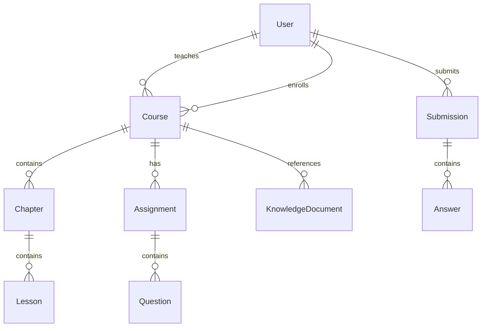

# 技术架构文档 (Technical Architecture)

## 1. 系统架构总览

### 1.1 架构原则
- **模块化设计**：高内聚、低耦合
- **分层架构**：清晰的职责划分
- **异步优先**：提升系统吞吐量
- **安全第一**：多层安全防护
- **可扩展性**：支持水平扩展

### 1.2 系统架构图
```
┌────────────────────────────────────────────────────────┐
│                    客户端层                            │
│          Web浏览器 / 移动应用 / API客户端              │
└────────────────────────────────────────────────────────┘
                            │
                            ▼
┌────────────────────────────────────────────────────────┐
│                    网关层                              │
│              Nginx (反向代理/负载均衡)                 │
└────────────────────────────────────────────────────────┘
                            │
                            ▼
┌────────────────────────────────────────────────────────┐
│                  应用服务层                            │
│                FastAPI Application                     │
│  ┌─────────────┬──────────────┬──────────────────┐    │
│  │   API路由   │   中间件     │    依赖注入      │    │
│  │  (Routers)  │ (Middleware) │ (Dependencies)   │    │
│  └─────────────┴──────────────┴──────────────────┘    │
└────────────────────────────────────────────────────────┘
                            │
                            ▼
┌────────────────────────────────────────────────────────┐
│                  业务逻辑层                            │
│  ┌──────────────┬──────────────┬─────────────────┐    │
│  │  课程服务    │   AI服务     │   分析服务      │    │
│  │  作业服务    │  评分服务    │   用户服务      │    │
│  │  知识库服务  │  问答服务    │   认证服务      │    │
│  └──────────────┴──────────────┴─────────────────┘    │
└────────────────────────────────────────────────────────┘
                            │
                            ▼
┌────────────────────────────────────────────────────────┐
│                  数据访问层                            │
│               SQLAlchemy ORM                           │
│  ┌──────────────┬──────────────┬─────────────────┐    │
│  │   Models     │ Repositories │   Queries       │    │
│  └──────────────┴──────────────┴─────────────────┘    │
└────────────────────────────────────────────────────────┘
                            │
                            ▼
┌────────────────────────────────────────────────────────┐
│                  数据存储层                            │
│  ┌──────────────┬──────────────┬─────────────────┐    │
│  │ PostgreSQL   │    Redis     │   ChromaDB      │    │
│  │  (主数据库)  │   (缓存)     │  (向量数据库)   │    │
│  └──────────────┴──────────────┴─────────────────┘    │
└────────────────────────────────────────────────────────┘
                            │
                            ▼
┌────────────────────────────────────────────────────────┐
│                  外部服务层                            │
│  ┌──────────────┬──────────────┬─────────────────┐    │
│  │ 千问API      │   文件存储   │   消息队列      │    │
│  │ (AI服务)     │   (OSS)      │  (RabbitMQ)     │    │
│  └──────────────┴──────────────┴─────────────────┘    │
└────────────────────────────────────────────────────────┘
```

## 2. 核心组件详解

### 2.1 应用服务层 (FastAPI)

#### 2.1.1 技术选型理由
- **高性能**：基于Starlette和Pydantic，性能优异
- **异步支持**：原生async/await支持
- **自动文档**：OpenAPI规范，自动生成API文档
- **类型安全**：强类型检查，减少运行时错误

#### 2.1.2 中间件配置
```python
# CORS中间件
app.add_middleware(
    CORSMiddleware,
    allow_origins=settings.cors_origins,
    allow_credentials=True,
    allow_methods=["*"],
    allow_headers=["*"],
)

# 请求日志中间件
@app.middleware("http")
async def log_requests(request: Request, call_next):
    request_id = str(uuid.uuid4())
    request.state.request_id = request_id
    # 日志记录逻辑
```

### 2.2 业务逻辑层

#### 2.2.1 服务模块划分
| 服务模块 | 职责 | 主要功能 |
|---------|------|---------|
| CourseService | 课程管理 | 课程CRUD、章节管理、资源管理 |
| AssignmentService | 作业管理 | 作业发布、提交、批改 |
| AIService | AI集成 | 题目生成、智能批改、问答 |
| AnalyticsService | 数据分析 | 学习进度、成绩分析、报表 |
| KnowledgeService | 知识库 | 文档索引、向量检索、RAG |

#### 2.2.2 设计模式
- **Repository模式**：数据访问抽象
- **Service模式**：业务逻辑封装
- **Factory模式**：对象创建管理
- **Strategy模式**：算法策略选择

### 2.3 数据模型设计

#### 2.3.1 核心实体关系


#### 2.3.2 数据库设计原则
- **规范化**：遵循3NF原则
- **索引优化**：关键查询字段建立索引
- **软删除**：is_deleted标记，保留数据
- **审计追踪**：created_at, updated_at时间戳

### 2.4 AI集成架构

#### 2.4.1 千问API集成
```python
class QwenClient:
    def __init__(self):
        self.client = OpenAI(
            api_key=settings.dashscope_api_key,
            base_url="https://dashscope.aliyuncs.com/compatible-mode/v1",
        )
        self.model = "qwen-plus"
    
    async def generate(self, prompt: str, **kwargs):
        # 实现细节...
```

#### 2.4.2 Prompt工程架构
- **模板管理**：结构化Prompt模板
- **上下文注入**：动态上下文构建
- **响应解析**：结构化输出处理
- **错误处理**：重试和降级策略

### 2.5 安全架构

#### 2.5.1 认证与授权
- **JWT认证**：无状态token认证
- **RBAC授权**：基于角色的访问控制
- **权限中间件**：请求级别权限检查

#### 2.5.2 安全防护措施
| 安全威胁 | 防护措施 |
|---------|---------|
| SQL注入 | ORM参数化查询 |
| XSS攻击 | 输入验证和转义 |
| CSRF攻击 | Token验证 |
| 文件上传 | 类型和大小限制 |
| DDoS攻击 | 速率限制 |

## 3. 性能优化策略

### 3.1 缓存策略
- **Redis缓存**：热点数据缓存
- **应用级缓存**：内存缓存
- **CDN缓存**：静态资源缓存

### 3.2 数据库优化
- **连接池**：复用数据库连接
- **查询优化**：避免N+1查询
- **读写分离**：主从架构
- **分表分库**：水平扩展

### 3.3 异步处理
- **异步API**：async/await
- **后台任务**：Celery任务队列
- **批处理**：批量操作优化

## 4. 可扩展性设计

### 4.1 水平扩展
- **无状态设计**：应用服务可水平扩展
- **负载均衡**：Nginx/HAProxy
- **服务发现**：Consul/Etcd

### 4.2 垂直扩展
- **模块化设计**：功能模块独立部署
- **微服务化**：服务拆分
- **消息队列**：解耦服务通信

## 5. 监控与运维

### 5.1 监控体系
- **应用监控**：Prometheus + Grafana
- **日志管理**：ELK Stack
- **链路追踪**：Jaeger
- **告警系统**：AlertManager

### 5.2 运维工具
- **容器化**：Docker
- **编排工具**：Kubernetes
- **CI/CD**：GitHub Actions
- **配置管理**：Ansible

## 6. 技术债务与改进计划

### 6.1 当前技术债务
- 缺少完整的单元测试
- API版本管理待完善
- 缓存策略需要优化
- 监控体系待建设

### 6.2 技术改进路线图
- **Q1 2024**：完善测试体系
- **Q2 2024**：微服务化改造
- **Q3 2024**：性能优化
- **Q4 2024**：云原生改造

---

*本文档定期更新，反映最新的架构决策和技术选型*